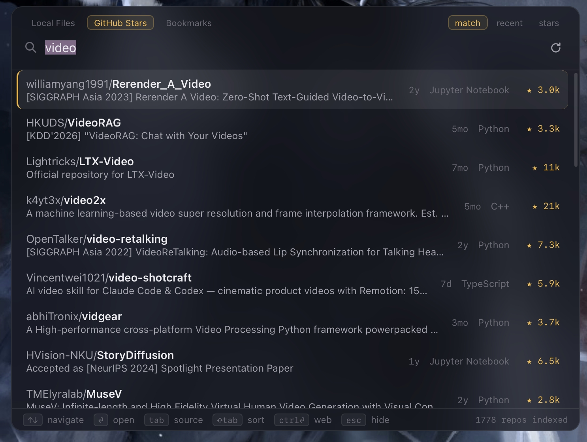
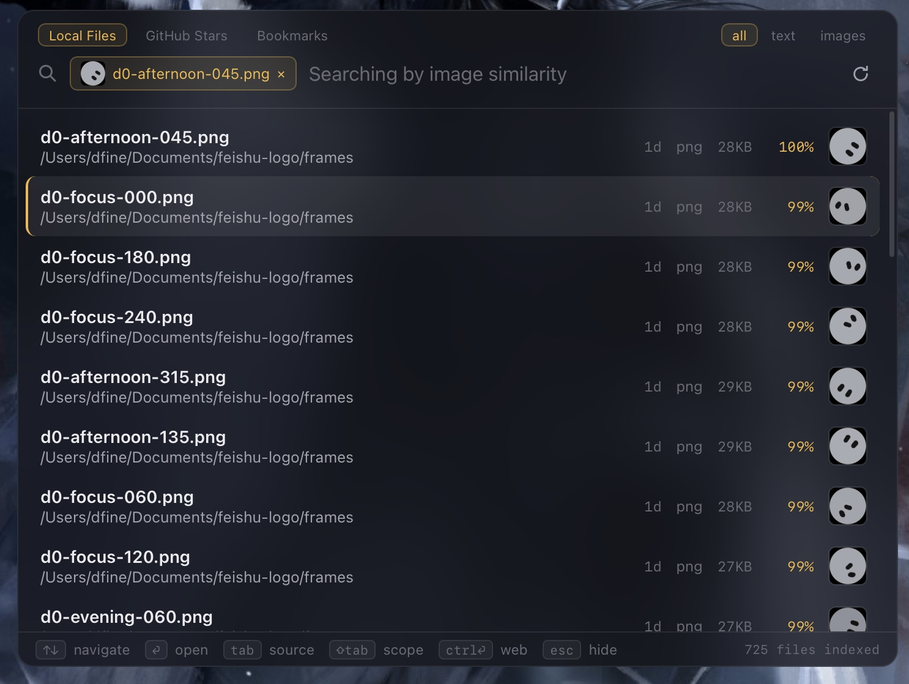
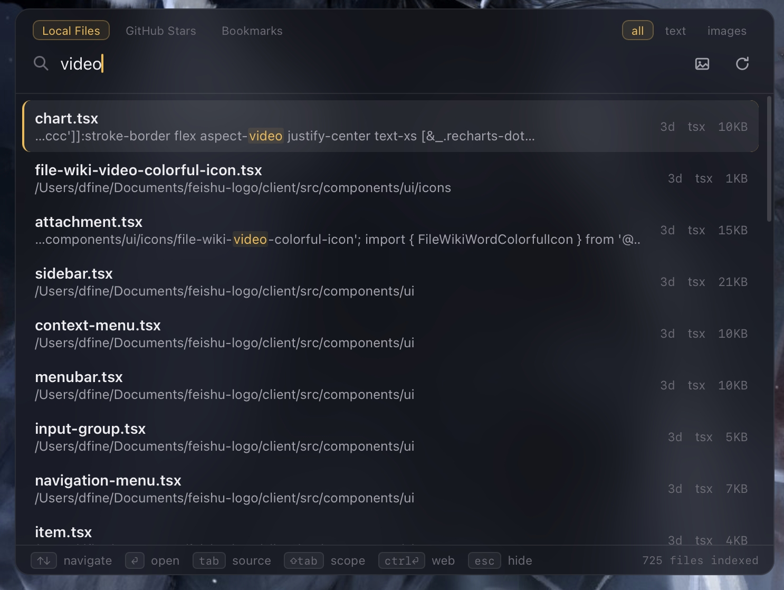
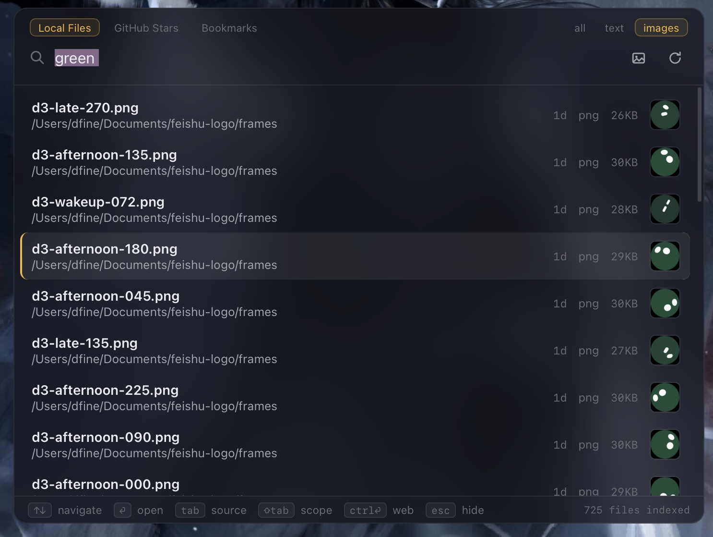
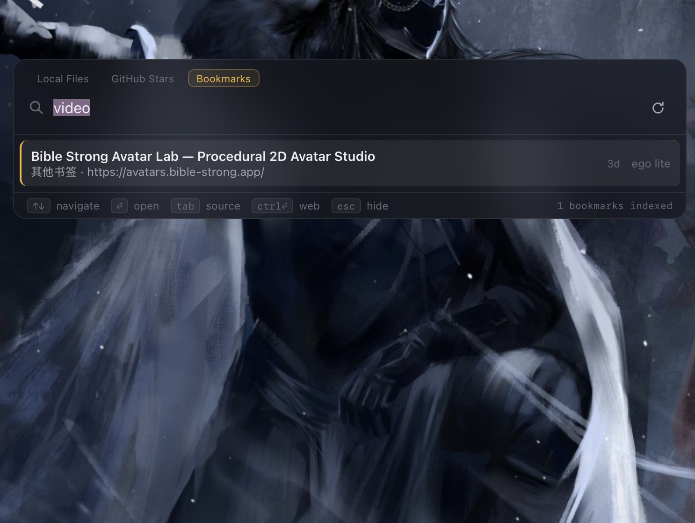

# magpie

> Spotlight-style search for everything you saved and forgot.

[简体中文](README.zh-CN.md)

Magpies hoard shiny things and famously forget where they put them. So do we:
GitHub stars we never open again, files buried in project folders, screenshots
we can describe but cannot find, bookmarks lost in folder trees. **magpie** is
a tiny desktop launcher that brings them back — press a hotkey, type what you
vaguely remember (or drop in an image), hit Enter.

<p align="center"></p>

<table>
  <tr>
    <td><br><sub>Drop in an image — most similar files rank with cosine percentages</sub></td>
    <td><br><sub>Full-text hits show highlighted context snippets</sub></td>
  </tr>
  <tr>
    <td><br><sub>Describe a picture in any language, get matching images</sub></td>
    <td><br><sub>Bookmarks from any Chromium fork and Firefox</sub></td>
  </tr>
</table>

## Why magpie

**Privacy first, by architecture — not by promise.**

- **No full-disk scanning, ever.** magpie only indexes folders you explicitly
  add — point it at your working directories and nothing else is ever read.
  Scanning is recursive within those folders, `.gitignore` rules are respected
  (even outside git repos), hidden files are skipped, and symlinks are never
  followed out of the folders you chose. Nested or duplicate folders are
  rejected up front.
- **Everything stays on your machine.** The index is a single SQLite file in
  your user profile. Embedding models run locally via ONNX; after the one-time
  download the whole thing works offline. Bookmarks are read straight from
  local browser files — no browser APIs, no accounts. Nothing is sent
  anywhere.
- **You can see exactly what is indexed** and remove any folder with one
  click; its files, search index, and vectors are wiped together. Every
  folder (and the star index) also has a rebuild-from-scratch button.

**Search that understands meaning, not just keywords.**

- Hybrid retrieval: SQLite FTS5 (BM25) keyword search fused with local
  semantic embeddings (`multilingual-e5-small`) via reciprocal rank fusion.
- Cross-language: query in Chinese, match English READMEs and code — and vice
  versa (100+ languages).
- Long content is chunked (~1600 chars, overlapping) with one vector per
  chunk — a sentence 100 pages deep still surfaces; documents and READMEs
  rank by their best chunk.
- Keyword hits show a highlighted context snippet with ellipsis.
- Millisecond-fast: vectors live in memory, a query embeds in ~5 ms, and
  keyword search keeps working while models warm up.

## Sources (`Tab` cycles them)

### Local Files

Add your everyday working folders; **every file** in them is findable by
name, and understood formats are searched in full text:

- ~80 plain-text and code formats, read whole (size cap configurable, up to
  unlimited)
- **PDF** via [pdf-inspector](https://github.com/firecrawl/pdf-inspector)
  (scanned/garbled PDFs stay findable by name)
- **Word / Excel / PowerPoint** (docx, xlsx, pptx)
- Everything else — video, archives, binaries — indexes by filename
- Scope pills (or `Shift+Tab`) narrow results: **all / text / images**

**Images** are embedded with **SigLIP 2** and searchable by content:

- *Text → image*: type "sunset over the sea" in any language; matching photos
  rank alongside other results, thumbnails included.
- *Image → image*: drag an image onto the palette, paste a screenshot, or
  click the pick-image button — magpie returns the most similar indexed
  images with cosine-similarity percentages.

The index is incremental: startup, manual refresh, and a 30-minute timer pick
up new, changed, and deleted files automatically.

### GitHub Stars

Paste a personal access token (no scopes needed) and magpie syncs your entire
star list: names, descriptions, topics, and full READMEs (chunk-embedded).
Unstars are detected, README fetches are ETag-incremental, and only changed
content re-embeds. Sort matches by relevance, starred date, or star count
(pills or `Shift+Tab`); every row shows last-push time so abandoned projects
are obvious.

### Applications

Typing in the Local tab surfaces matching installed apps as top hits (an
`App` badge marks them) — `Enter` launches. Names match by prefix, substring,
or acronym (`vsc` → Visual Studio Code). Apps come from the Start Menu on
Windows, `/Applications` on macOS, and `.desktop` entries on Linux.

### Web (bookmarks + history)

The Web tab searches **browser bookmarks and history together**; `Shift+Tab`
narrows to all / bookmarks / history. History covers page titles and URLs
(not just addresses) with a visit-count boost so pages you open often rank
higher; only the most-visited pages per profile are kept. Bookmarks come from
**any Chromium-based browser** — Chrome, Edge, Brave,
Vivaldi, Arc, and lesser-known forks are auto-discovered by their on-disk
profile layout — plus Firefox. Read directly from local stores (all
profiles), searchable by title, URL, and folder path, with semantic matching
on top. `Enter` opens the bookmark in your default browser.

### Quick web launcher

magpie also doubles as the fastest route to the web. Summon the palette from
inside any app, type a URL or whatever you want to look up, and hit
`Ctrl+Enter`: URL-looking input opens directly in your default browser,
anything else becomes a web search. No switching windows, no reaching for
the browser's address bar first.

### Clipboard History

Off by default. When you enable it in Settings, copied text is recorded to a
local database (not the system clipboard history) and searchable from the
Clipboard tab — the one source where an empty query is useful, listing what
you most recently copied. `Enter` copies an entry back; `Ctrl+Delete` removes
the selected entries; `Shift`+arrows multi-select (and `Enter` then copies
them joined). Text marked confidential by password managers is never
recorded. Cap history by count (500 / 2000 / unlimited) and age (7 / 30 days
/ forever), or clear it entirely.

## Keyboard

| Key | Action |
|---|---|
| `Alt+Space` | summon / dismiss the palette (configurable in settings) |
| `↑` `↓` / `PgUp` `PgDn` | move / page through results |
| `Enter` | open: repos & bookmarks in the browser, files revealed in Explorer/Finder |
| `Ctrl+Enter` | hand the query to the browser: URL-looking input opens directly, anything else web-searches |
| `Tab` | switch source (Local / Stars / Bookmarks) |
| `Shift+Tab` | cycle local scope, or star sort order |
| `Esc` | clear image query → close settings → hide window |
| drop / paste / pick an image | search by image similarity |

The palette sits top-center, stays above every window, never hides on focus
loss (so drag-and-drop works), and can be dragged by its tab strip.

## Settings (tray icon → Settings…)

GitHub token (with connection badge) · indexed folders (add / remove /
rebuild) · appearance (auto / light / dark) · summon shortcut (recordable) ·
model download source (huggingface.co or **hf-mirror.com** for networks where
HF is unreachable) · max file size (4/16/64 MB or unlimited) · tab order and default tab · clipboard history controls ·
model download status · one-click in-place updates (signed, verified) ·
app version.

## Install

Grab the latest build from [Releases](https://github.com/newdee/magpie/releases):
Windows NSIS installer, macOS dmg (Apple Silicon), Linux AppImage/deb/rpm.

**macOS tip** — builds are unsigned, so a browser-downloaded dmg triggers
Gatekeeper. Installing via curl skips the quarantine flag entirely:

```sh
curl -L https://github.com/newdee/magpie/releases/latest/download/magpie_aarch64.app.tar.gz | tar xz -C /Applications
```

(Or: right-click the app → Open; if it says "damaged", run
`xattr -cr /Applications/magpie.app`.)

First launch downloads the embedding models (~700 MB total); keyword search
works immediately while they warm up.

## Build from source

```sh
pnpm install
pnpm tauri dev      # development
pnpm tauri build    # release bundle
cargo test -p magpie-core    # core tests
```

Requires Rust, Node + pnpm, and a WebView2/WebKit runtime (bundled on
Windows 11 and macOS).

## Architecture

```
core/       Rust library: SQLite + FTS5, GitHub sync, folder indexing,
            bookmark parsing, e5 + SigLIP embeddings, hybrid ranking
src-tauri/  thin Tauri shell: commands, tray, global hotkey, window
src/        React palette UI (one window)
```

The vector "database" is deliberately boring: L2-normalized f32 BLOBs in
SQLite, brute-forced in memory (<15 ms at tens of thousands of chunks, 100%
recall). If a corpus ever outgrows that, `sqlite-vec` drops into the same
file.

## Roadmap

- Twitter/X likes as a source (via your data-export archive — no paid API)
- OCR for scanned PDFs and screenshots
- Result preview pane
- Signed & notarized macOS builds

## License

[MIT](LICENSE)
