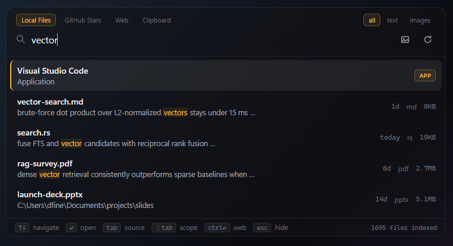
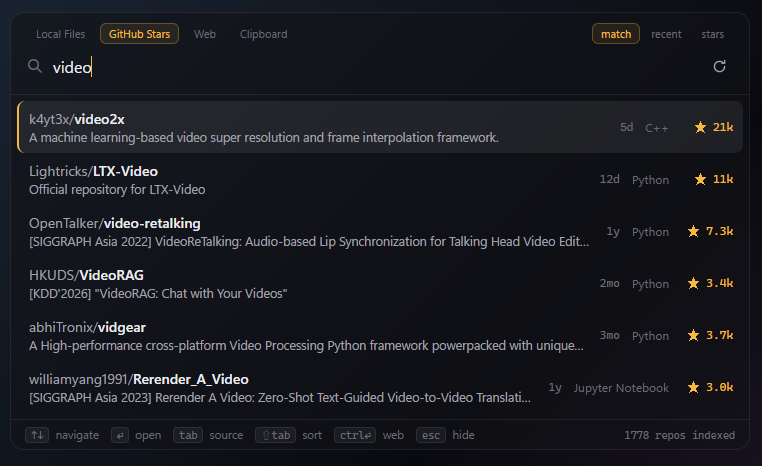
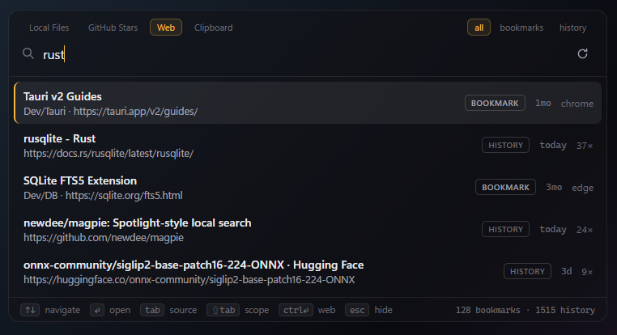
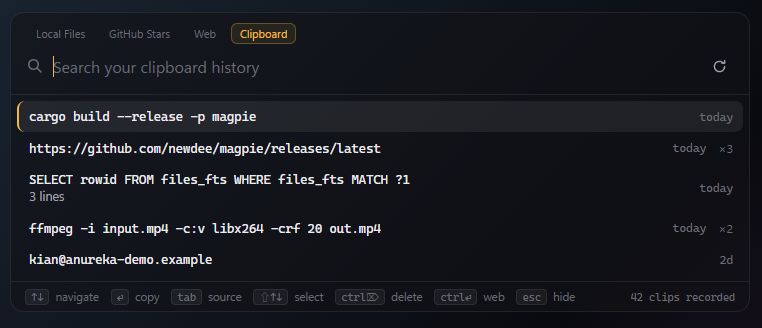

# magpie

> 一个 Spotlight 式启动器，找回你存过但忘掉的一切。

[English](README.md)

喜鹊爱收集闪亮的东西，又出了名地忘记藏在哪。人也一样：star 过再也没打开过的
GitHub 项目、埋在项目目录深处的文件、能描述出画面却找不到的截图、迷失在浏览器
里的书签和历史、一小时前复制的那段话、藏在三层菜单里的应用。**magpie** 是一个
小巧的桌面启动器，把它们统统找回来——按下快捷键，输入模糊的印象（或者拖进一张
图），回车。

<p align="center">
  <a href="https://github.com/newdee/magpie/releases/download/v0.1.14/magpie-demo.mp4">
    </a>
  <br>
  <sub>▶ <a href="https://github.com/newdee/magpie/releases/download/v0.1.14/magpie-demo.mp4">带声音的完整高清版</a> · 40s · 4 MB</sub>
</p>

<p align="center"></p>

<table>
  <tr>
    <td><br><sub>GitHub stars 含 README 全文检索，带排序与时间</sub></td>
    <td><br><sub>书签和浏览器历史合并在一个 Web tab</sub></td>
  </tr>
  <tr>
    <td><br><sub>剪贴板历史：复制回、多选、删除</sub></td>
    <td><br><sub>拖进一张图——最相似的文件按相似度排列</sub></td>
  </tr>
</table>

## 为什么选 magpie

**隐私优先，靠架构保证，不靠承诺。**

- **永不全盘扫描。** 只索引你显式添加的文件夹——把常用工作路径加进去即可，
  其余任何位置永远不会被读取。文件夹内递归扫描，尊重 `.gitignore`（非 git 目
  录同样生效），跳过隐藏文件，绝不追踪符号链接越出白名单；重复或嵌套的文件夹
  会被直接拒绝。
- **数据不出本机。** 索引是用户目录里的一个 SQLite 文件；嵌入模型通过 ONNX
  在本地运行，首次下载后完全离线。书签直接读浏览器本地文件——不走任何 API、
  不要账号。没有任何东西被上传。
- **索引内容完全透明**：文件夹随时一键移除（文件、全文索引、向量一并清除），
  每个文件夹和 star 索引都有"从零重建"按钮。

**理解语义的搜索，不只是关键词。**

- 混合检索：SQLite FTS5（BM25）关键词 + 本地语义向量
  （`multilingual-e5-small`），RRF 排名融合。
- 跨语言：中文查询命中英文 README 和代码，反之亦然（100+ 语言）。
- 长内容自动分块（约 1600 字符、带重叠），每块独立向量——第 100 页里的一句
  话也能被搜到，文档和 README 按最佳块得分排名。
- 关键词命中显示高亮上下文片段（前后省略号）。
- 毫秒级：向量常驻内存，查询嵌入约 5ms；模型预热期间关键词搜索照常可用。

**一个启动器，收纳你存下的一切。**

- **五类东西，一个快捷键**：本地文件（全文 + 文件名）、以内容搜图、GitHub
  stars、浏览器书签**和**历史、剪贴板、已装应用——全在 `Alt+Space` 之后。
- **搜到视频内部**：镜头切分 + 嵌入，一张图或一句描述直接定位到具体场景，
  带精确时间范围。
- **真正的应用启动器**：输入应用名（前缀、子串或首字母缩写如 `vsc`）回车即
  启动——开始菜单、`/Applications`、Linux `.desktop` 都覆盖。中文应用名支持
  **拼音匹配**：`wx`、`weixin`、`txhy` 直接启动微信、腾讯会议，不用切输入法。
- **中英双语界面**：整个 UI（含托盘菜单）支持简体中文和英文——默认跟随系统，
  设置里可切换。
- **尊重机密的剪贴板历史**：默认关、本地存储，密码管理器标记为机密的内容永不
  记录（Windows 与 macOS 都遵守）。可按条数和时间限制、多选删除。
- **自动保持最新**：从这版起签名校验的原地自动更新——无需重装。
- **顺序随你排**：自定义 tab 顺序、指定启动时打开哪个 tab。
- **网络不通也能用**：一键切 `hf-mirror.com` 下模型，断点续传 + 实时进度。
- **跨平台**：Windows、macOS（Apple Silicon）、Linux。

## 数据源（`Tab` 键切换）

### 本地文件

添加日常工作目录后，其中**任何文件**都能按文件名搜到，可解析的格式支持全文
检索：

- 近 80 种文本/代码格式，整文件读取（大小上限可配置，支持无上限）
- **PDF**：经 [pdf-inspector](https://github.com/firecrawl/pdf-inspector)
  解析（扫描版/乱码 PDF 仍可按文件名找到）
- **Word / Excel / PowerPoint**（docx、xlsx、pptx）
- 其余一切——视频、压缩包、二进制——按文件名索引
- 范围切换（点选或 `Shift+Tab`）：**全部 / 仅文本 / 仅图片**

**图片**经 **SigLIP 2** 嵌入，按画面内容检索：

- *文字搜图*：任何语言输入"海边日落"，匹配照片带缩略图混排在结果中。
- *以图搜图*：拖一张图进窗口、粘贴截图、或点选图按钮——返回最相似的已索引
  图片，并显示余弦相似度百分比。

**视频**再深一层：文件夹里的每个视频按**镜头**切分（2 fps 抽帧 + 直方图
场景变化检测，纯 Rust 实现），每个镜头的代表帧经 SigLIP 嵌入——图片和文字
查询都能命中视频**内部**：结果行显示匹配镜头的缩略图和精确时间范围
（`3:24 – 3:42`）。解码用 ffmpeg——自动使用系统安装，缺失时一次性下载
静态版。设置里可开关。

索引全程增量：启动时、手动刷新、常驻期间每 30 分钟自动跟进增删改。

### GitHub Stars

贴一个 PAT（无需任何 scope），同步完整 star 列表：名称、描述、topics 和
**README 全文（分块嵌入）**。自动检测取消 star，README 用 ETag 增量拉取，只
有变化的内容才重新嵌入。结果可按相关度 / 收藏时间 / 星数排序（点选或
`Shift+Tab`），每行显示最后 push 时间，一眼识别弃坑项目。

### 应用启动

在「本地」tab 输入时，匹配的已装应用作为置顶命中出现（标 `应用` 徽章），
`Enter` 启动。名字支持前缀、子串、首字母缩写匹配（`vsc` → Visual Studio
Code）。中文名还支持**全拼和首字母拼音**（`wx` / `weixin` → 微信，
`wangyiyun` → 网易云音乐），多音字全覆盖（`cq`、`zq` 都能找到重庆…），
启动应用彻底告别切输入法——设置里可开关。应用来源：Windows 开始菜单、
macOS `/Applications`、Linux `.desktop`。

应用还认**别名**：内置中英名对照表打通两个方向（输 `lark` 找到飞书、输
`weixin` 找到装成 *WeChat* 的微信），Linux 免费吃进 `.desktop` 的
`Keywords=`/`GenericName=`，设置里还能自定义规则（`proxy = clash`，一行
一条）——别名当作第二名字参与匹配，拼音同样生效。

### Web（书签 + 历史）

「Web」tab 同时检索**浏览器书签和历史**；`Shift+Tab` 切换 全部 / 书签 /
历史。历史覆盖页面标题和 URL（不只网址），按访问次数加权——常开的页面排
更前；每个 profile 只保留访问最多的页面。书签来自**任意 Chromium 内核
浏览器**——Chrome、Edge、Brave、Vivaldi、Arc 及
各种小众分支，按磁盘上的 profile 结构自动发现——外加 Firefox。直接读浏览器
本地存储（全部 profile），按标题、URL、文件夹路径检索并叠加语义匹配。
`Enter` 在默认浏览器打开。

### 顺手一个快捷浏览器入口

magpie 也是去往网页的最短路径：在任何应用里唤出浮窗，输入网址或想搜的内容，
`Ctrl+Enter`——像网址就直接在默认浏览器打开，其余自动变成网页搜索。不用切窗
口、不用先去点浏览器地址栏。

### 剪贴板历史

默认关闭。在设置里开启后，复制的文本会记录到本地数据库（不是系统剪贴板
历史），从「剪贴板」tab 检索——这是唯一空查询也有用的源，直接列出你最近
复制的内容。`Enter` 把某条复制回去；`Ctrl+Delete` 删除选中；`Shift`+方向键
多选（`Enter` 合并复制多条）。密码管理器标记为机密的内容永不记录。可按条数
（500 / 2000 / 无限）和时间（7 / 30 天 / 永久）限制历史，或一键清空。

## 快捷键

| 键 | 动作 |
|---|---|
| `Alt+Space` | 唤出 / 收起浮窗（设置中可重绑） |
| `↑` `↓` / `PgUp` `PgDn` | 选择 / 翻页 |
| `Enter` | 按类型动作：repo/书签/历史进浏览器、文件在资源管理器定位、启动应用、复制剪贴条 |
| `Ctrl+Enter` | 把输入交给浏览器——像网址就直接打开，否则网页搜索 |
| `Tab` | 下一个数据源（本地 / Stars / Web / 剪贴板，顺序在设置里定） |
| `Shift+Tab` | 循环当前源的模式：本地范围（全部/文本/图片）、Web 范围（全部/书签/历史）、star 排序 |
| `Shift`+`↑` `↓` | 扩展多选（剪贴板 tab） |
| `Ctrl+Delete` | 删除选中的剪贴条（剪贴板 tab） |
| `Esc` | 清除图片查询 → 关闭设置 → 收起窗口 |
| 拖拽 / 粘贴 / 选图 | 以内容搜本地图片 |

浮窗固定在屏幕中上、置顶于所有窗口、失焦不消失（保证拖拽可用），按住顶部标
签条可拖动。tab 顺序和启动时打开哪个 tab 都可自定义。

## 设置（托盘图标 → Settings…）

GitHub token（带连接徽章）· 索引文件夹（添加/移除/重建）· 主题（跟随系统/
浅色/深色）· **界面语言（跟随系统 / English / 中文）** · 拼音匹配应用开关 ·
应用别名 ·
唤出快捷键（按键录制）· 模型下载源（huggingface.co 或
**hf-mirror.com** 国内镜像）· 文件大小上限（4/16/64 MB 或无上限）· 视频镜头
搜索开关 · 标签页顺序与默认标签页 · 剪贴板历史
开关 · 模型下载状态 · 一键原地更新（minisign 签名校验）· 版本号。

## 安装

从 [Releases](https://github.com/newdee/magpie/releases) 下载：Windows NSIS
安装包、macOS dmg（Apple Silicon）、Linux AppImage/deb/rpm。

**macOS 提示**——构建未签名，浏览器下载的 dmg 会触发 Gatekeeper。用 curl 安装
可完全跳过隔离标记：

```sh
curl -L https://github.com/newdee/magpie/releases/latest/download/magpie_aarch64.app.tar.gz | tar xz -C /Applications
```

（或者：右键 app → 打开；若提示"已损坏"，执行
`xattr -cr /Applications/magpie.app`。）

首次启动自动下载嵌入模型（共约 700MB）；预热期间关键词搜索立即可用。

## 从源码构建

```sh
pnpm install
pnpm tauri dev      # 开发
pnpm tauri build    # 发布构建
cargo test -p magpie-core    # 核心测试
```

需要 Rust、Node + pnpm、WebView2/WebKit 运行时（Windows 11 与 macOS 自带）。

## 架构

```
core/       Rust 库：SQLite + FTS5、GitHub 同步、目录索引、书签+历史+剪贴板
            +应用 数据源、e5 + SigLIP 嵌入、混合排名
src-tauri/  Tauri 薄壳：命令、托盘、全局快捷键、窗口、剪贴板监视、自动更新
src/        React 浮窗 UI（单窗口）
```

向量"数据库"刻意保持朴素：L2 归一化的 f32 BLOB 存 SQLite，内存暴力点积
（数万块 <15ms，100% 召回）。规模超出时可在同一数据库文件上换用
`sqlite-vec`。

## 路线图

- Twitter/X 点赞源（通过数据导出档案——不依赖付费 API）
- 扫描版 PDF 与截图的 OCR
- 结果预览面板
- macOS 签名与公证构建

## 协议

[MIT](LICENSE)
